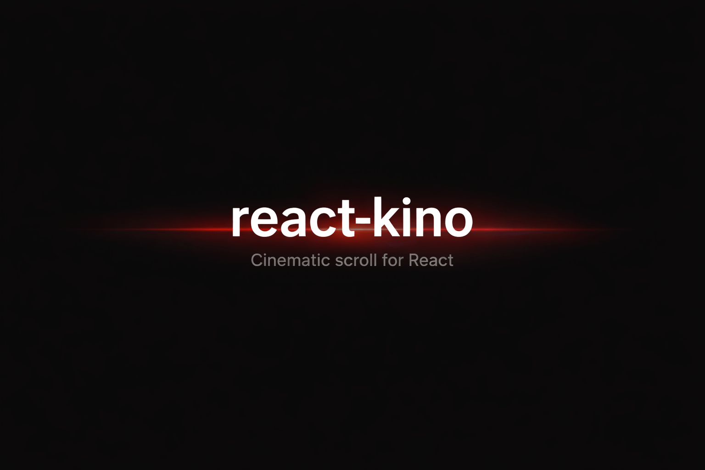
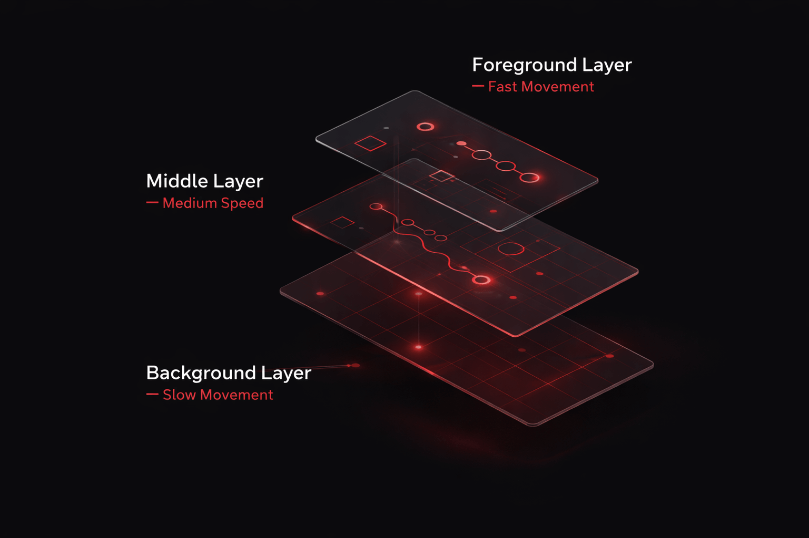
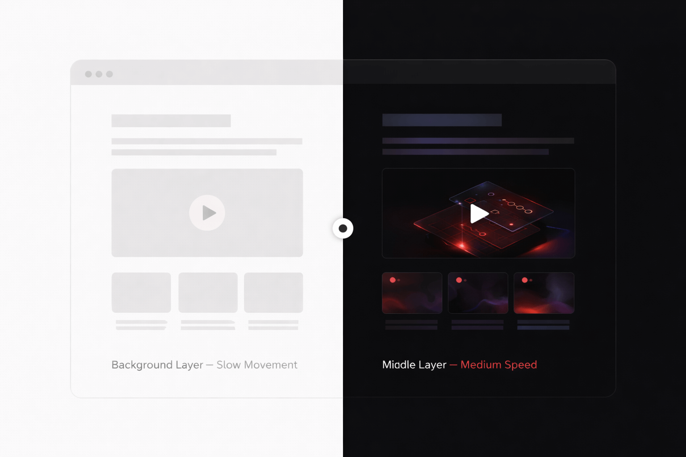

<p align="center">
  
</p>

<p align="center">
  
  
  
</p>

<h1 align="center">react-kino</h1>

<p align="center">
Cinematic scroll-driven storytelling for React.<br/>
Core scroll engine under 1 KB gzipped.
</p>

---

## Why react-kino

- **Tiny** -- the core scroll engine is under 1 KB gzipped. GSAP ScrollTrigger alone is 33 KB.
- **Declarative** -- compose `<Scene>`, `<Reveal>`, `<Parallax>`, and `<Counter>` like regular React components. No imperative timelines.
- **Lightweight runtime** -- `react-kino` uses a tiny internal engine package (`@kino/core`) plus React peers.
- **SSR-safe** -- every component renders children on the server and animates on the client.

## Installation

```bash
npm install react-kino
```

```bash
pnpm add react-kino
```

```bash
bun add react-kino
```

**Requirements:** React 18+

## Quick Start

```tsx
import { Kino, Scene, Reveal, Counter } from "react-kino";

function App() {
  return (
    <Kino>
      {/* A pinned scene that spans 300vh of scroll distance */}
      <Scene duration="300vh">
        {(progress) => (
          <div style={{ height: "100vh", display: "grid", placeItems: "center" }}>
            <Reveal animation="fade-up" at={0}>
              <h1>Welcome</h1>
            </Reveal>

            <Reveal animation="scale" at={0.3}>
              <p>Scroll-driven storytelling, made simple.</p>
            </Reveal>

            <Reveal animation="fade" at={0.6}>
              <Counter from={0} to={10000} format={(n) => `${n.toLocaleString()}+ users`} />
            </Reveal>
          </div>
        )}
      </Scene>
    </Kino>
  );
}
```

That is a complete scroll experience: the section pins in place, content fades in at different scroll points, and a number counts up -- all in ~20 lines.

---

## Components

### `<Kino>`

Root provider that initializes the scroll tracking engine. Wrap your app or page layout.

```tsx
import { Kino } from "react-kino";

<Kino>
  {/* your scenes and content */}
</Kino>
```

| Prop | Type | Default | Description |
|------|------|---------|-------------|
| `children` | `ReactNode` | -- | Child elements |

---

### `<Scene>`

A pinned scroll section. Content stays fixed in the viewport while the user scrolls through the scene's duration. This is the core building block.

`<Scene>` creates a tall spacer element (matching `duration`) with a sticky inner container. As the user scrolls through the spacer, progress goes from `0` to `1`. Children can be static ReactNode or a render function that receives the current progress.

```tsx
import { Scene } from "react-kino";

{/* Static children -- use child components that read progress from context */}
<Scene duration="200vh">
  <MyAnimatedContent />
</Scene>

{/* Render prop -- get progress directly */}
<Scene duration="400vh">
  {(progress) => (
    <div style={{ opacity: progress }}>
      {Math.round(progress * 100)}% scrolled
    </div>
  )}
</Scene>
```

| Prop | Type | Default | Description |
|------|------|---------|-------------|
| `duration` | `string` | -- | Scroll distance the scene spans. Supports `vh` and `px` units (e.g. `"200vh"`, `"1500px"`) |
| `pin` | `boolean` | `true` | Whether to pin (sticky) the inner content during scroll |
| `children` | `ReactNode \| (progress: number) => ReactNode` | -- | Static content or render function receiving progress (0-1) |
| `className` | `string` | -- | CSS class for the outer spacer element |
| `style` | `CSSProperties` | -- | Inline styles for the sticky inner container |

**Context:** `<Scene>` provides a `SceneContext` that child components (`<Reveal>`, `<Counter>`, `<CompareSlider>`) automatically read from. You do not need to pass progress manually.

---

### `<Reveal>`

Scroll-triggered entrance animation. Place inside a `<Scene>` or provide a `progress` prop directly.

```tsx
import { Reveal } from "react-kino";

<Scene duration="300vh">
  <Reveal animation="fade-up" at={0.2}>
    <h2>Appears at 20% scroll</h2>
  </Reveal>

  <Reveal animation="blur" at={0.5} duration={800} delay={200}>
    <p>Blurs in at 50% with a delay</p>
  </Reveal>
</Scene>
```

| Prop | Type | Default | Description |
|------|------|---------|-------------|
| `at` | `number` | `0` | Progress value (0-1) when animation triggers |
| `animation` | `RevealAnimation` | `"fade"` | Animation preset (see below) |
| `duration` | `number` | `600` | Animation duration in milliseconds |
| `delay` | `number` | `0` | Delay before animation starts in milliseconds |
| `progress` | `number` | -- | Direct progress override (0-1). If omitted, reads from parent `<Scene>` context |
| `children` | `ReactNode` | -- | Content to reveal |
| `className` | `string` | -- | CSS class for the wrapper div |

**Animation presets:**

| Preset | Effect |
|--------|--------|
| `"fade"` | Opacity 0 to 1 |
| `"fade-up"` | Fade in + slide up 40px |
| `"fade-down"` | Fade in + slide down 40px |
| `"scale"` | Fade in + scale from 0.9 to 1 |
| `"blur"` | Fade in + unblur from 12px |

---

### `<Parallax>`

A layer that scrolls at a different speed than the page, creating depth.

```tsx
import { Parallax } from "react-kino";

{/* Background image scrolls at half speed */}
<Parallax speed={0.3}>
  
</Parallax>

{/* Foreground element scrolls faster */}
<Parallax speed={1.5}>
  <div className="floating-badge">New</div>
</Parallax>
```

| Prop | Type | Default | Description |
|------|------|---------|-------------|
| `speed` | `number` | `0.5` | Speed multiplier. `1` = normal scroll, `< 1` = slower (background feel), `> 1` = faster (foreground feel) |
| `direction` | `"vertical" \| "horizontal"` | `"vertical"` | Scroll direction for the parallax offset |
| `children` | `ReactNode` | -- | Content to apply parallax to |
| `className` | `string` | -- | CSS class |
| `style` | `CSSProperties` | -- | Inline styles (merged with transform) |

<p align="center">
  
</p>

---

### `<Counter>`

An animated number that counts between two values as the user scrolls. Automatically reads progress from a parent `<Scene>`.

```tsx
import { Counter } from "react-kino";

<Scene duration="200vh">
  <Counter from={0} to={1000000} at={0.2} span={0.5} />

  <Counter
    from={0}
    to={99.9}
    format={(n) => `${n.toFixed(1)}%`}
    easing="ease-in-out"
  />
</Scene>
```

| Prop | Type | Default | Description |
|------|------|---------|-------------|
| `from` | `number` | -- | Starting value |
| `to` | `number` | -- | Ending value |
| `at` | `number` | `0` | Progress value (0-1) when counting begins |
| `span` | `number` | `0.3` | How much of the progress range (0-1) the count spans |
| `format` | `(value: number) => string` | `toLocaleString` | Formatting function for the displayed value |
| `easing` | `string \| (t: number) => number` | `"ease-out"` | Easing preset name or custom easing function |
| `progress` | `number` | -- | Direct progress override (0-1). If omitted, reads from parent `<Scene>` context |
| `className` | `string` | -- | CSS class for the `<span>` element |

When both `from` and `to` are integers, the displayed value is automatically rounded.

---

### `<CompareSlider>`

A before/after comparison slider. Supports both drag interaction and scroll-driven modes.

```tsx
import { CompareSlider } from "react-kino";

{/* Interactive drag mode */}
<CompareSlider
  before={}
  after={}
/>

{/* Scroll-driven mode inside a Scene */}
<Scene duration="200vh">
  <CompareSlider
    scrollDriven
    before={}
    after={}
  />
</Scene>
```

| Prop | Type | Default | Description |
|------|------|---------|-------------|
| `before` | `ReactNode` | -- | Content shown on the "before" side (always visible underneath) |
| `after` | `ReactNode` | -- | Content shown on the "after" side (revealed via clip) |
| `scrollDriven` | `boolean` | `false` | If `true`, slider position follows scroll progress instead of drag |
| `progress` | `number` | -- | Progress override (0-1). When `scrollDriven`, defaults to parent `<Scene>` context |
| `initialPosition` | `number` | `0.5` | Initial slider position (0-1) in drag mode |
| `className` | `string` | -- | CSS class for the container |

<p align="center">
  
</p>

---

### `<HorizontalScroll>`

Converts vertical scroll into horizontal movement. Wrap `<Panel>` components inside it.

```tsx
import { HorizontalScroll, Panel } from "react-kino";

<HorizontalScroll>
  <Panel>
    <div style={{ background: "#111", color: "#fff", padding: 60 }}>
      <h2>Panel One</h2>
    </div>
  </Panel>
  <Panel>
    <div style={{ background: "#222", color: "#fff", padding: 60 }}>
      <h2>Panel Two</h2>
    </div>
  </Panel>
  <Panel>
    <div style={{ background: "#333", color: "#fff", padding: 60 }}>
      <h2>Panel Three</h2>
    </div>
  </Panel>
</HorizontalScroll>
```

**`<HorizontalScroll>` props:**

| Prop | Type | Default | Description |
|------|------|---------|-------------|
| `children` | `ReactNode` | -- | `<Panel>` components |
| `className` | `string` | -- | CSS class for the outer spacer |
| `panelHeight` | `string` | `"100vh"` | Height of each panel as a CSS string |

**`<Panel>` props:**

| Prop | Type | Default | Description |
|------|------|---------|-------------|
| `children` | `ReactNode` | -- | Panel content |
| `className` | `string` | -- | CSS class |
| `style` | `CSSProperties` | -- | Inline styles (merged with default `100vw x 100vh` sizing) |

The spacer height is automatically set to `childCount * 100vh`, giving each panel a full viewport of scroll distance.

---

### `<Progress>`

A fixed scroll progress indicator. Supports bar, dots, and ring styles.

```tsx
import { Progress } from "react-kino";

{/* Simple top bar */}
<Progress />

{/* Ring indicator in the corner */}
<Progress type="ring" position="bottom" color="#10b981" ringSize={40} />

{/* Dot pagination on the right */}
<Progress type="dots" position="right" dotCount={8} color="#fff" />
```

| Prop | Type | Default | Description |
|------|------|---------|-------------|
| `type` | `"bar" \| "dots" \| "ring"` | `"bar"` | Visual style of the indicator |
| `position` | `"top" \| "bottom" \| "left" \| "right"` | `"top"` | Fixed position on screen |
| `color` | `string` | `"#3b82f6"` | Color of the progress fill / active dots / ring stroke |
| `trackColor` | `string` | `"transparent"` | Background / inactive color |
| `progress` | `number` | -- | Progress override (0-1). If omitted, reads page scroll progress |
| `dotCount` | `number` | `5` | Number of dots (only for `"dots"` type) |
| `ringSize` | `number` | `48` | Diameter in pixels (only for `"ring"` type) |
| `className` | `string` | -- | CSS class for the wrapper |

---

### `<VideoScroll>`

Scrubs through a video as the user scrolls — like the AirPods Pro / iPhone product pages. Pair with overlay children for animated text on top of the video.

```tsx
import { VideoScroll } from "react-kino";

<VideoScroll src="/product.mp4" duration="400vh" poster="/poster.jpg">
  {(progress) => (
    <div style={{ position: "absolute", inset: 0, display: "grid", placeItems: "center" }}>
      <h2 style={{ opacity: progress, color: "#fff", fontSize: "4rem" }}>
        Scroll to reveal
      </h2>
    </div>
  )}
</VideoScroll>
```

| Prop | Type | Default | Description |
|------|------|---------|-------------|
| `src` | `string` | -- | URL of the video file (MP4 recommended, no audio needed) |
| `duration` | `string` | `"300vh"` | Scroll distance the video scrubbing spans |
| `pin` | `boolean` | `true` | Whether to pin the video while scrubbing |
| `poster` | `string` | -- | Poster image shown before the video loads |
| `children` | `ReactNode \| (progress: number) => ReactNode` | -- | Overlay content rendered on top of the video |
| `className` | `string` | -- | CSS class for the outer spacer |

The video is `muted`, `playsInline`, and never autoplays. `currentTime` is set directly from scroll progress. `prefers-reduced-motion`: video stays on the poster frame.

---

### `<TextReveal>`

Word-by-word, character-by-character, or line-by-line text reveal driven by scroll progress.

```tsx
import { TextReveal } from "react-kino";

<Scene duration="300vh">
  {(progress) => (
    <TextReveal progress={progress} mode="word" at={0.1} span={0.7}>
      Scroll-driven storytelling components for React. Build cinematic experiences without the complexity.
    </TextReveal>
  )}
</Scene>
```

| Prop | Type | Default | Description |
|------|------|---------|-------------|
| `children` | `string` | -- | The text to reveal |
| `mode` | `"word" \| "char" \| "line"` | `"word"` | How to split the text into tokens |
| `at` | `number` | `0` | Progress value (0-1) when reveal starts |
| `span` | `number` | `0.8` | How much of the progress range the full reveal spans |
| `color` | `string` | currentColor | Color of revealed tokens |
| `dimColor` | `string` | -- | Color of unrevealed tokens (default: 15% opacity) |
| `progress` | `number` | -- | Direct progress override. If omitted, reads from parent `<Scene>` context |
| `className` | `string` | -- | CSS class for the wrapper |

`prefers-reduced-motion`: all text renders immediately at full opacity.

---

## Hooks

### `useScrollProgress()`

Returns the page-level scroll progress as a number from `0` to `1`.

```tsx
import { useScrollProgress } from "react-kino";

function ScrollPercentage() {
  const progress = useScrollProgress();
  return <div>{Math.round(progress * 100)}%</div>;
}
```

**Returns:** `number` -- progress from `0` (top of page) to `1` (bottom of page).

---

### `useSceneProgress(ref, durationPx)`

Returns scene-level scroll progress for a specific element. Useful when building custom scroll-driven components outside of `<Scene>`.

```tsx
import { useRef } from "react";
import { useSceneProgress } from "react-kino";

function CustomScene() {
  const ref = useRef<HTMLDivElement>(null);
  const progress = useSceneProgress(ref, 1500); // 1500px scroll distance

  return (
    <div ref={ref} style={{ height: 1500 }}>
      <div style={{ position: "sticky", top: 0 }}>
        Progress: {progress.toFixed(2)}
      </div>
    </div>
  );
}
```

**Parameters:**

| Param | Type | Description |
|-------|------|-------------|
| `spacerRef` | `RefObject<HTMLElement \| null>` | Ref to the spacer/container element |
| `durationPx` | `number` | Total scroll distance in pixels |

**Returns:** `number` -- progress from `0` to `1`.

---

### `useSceneContext()`

Access the progress value from a parent `<Scene>`. Useful for building custom components that react to scene progress.

```tsx
import { useSceneContext } from "react-kino";

function CustomFadeIn() {
  const { progress } = useSceneContext();
  return <div style={{ opacity: progress }}>I fade in as you scroll</div>;
}
```

**Returns:** `{ progress: number }` -- throws if used outside a `<Scene>`.

---

### `useKino()`

Access the root `ScrollTracker` instance from `<Kino>`. For advanced use cases where you need direct access to the scroll engine.

```tsx
import { useKino } from "react-kino";

function AdvancedComponent() {
  const { tracker } = useKino();
  // tracker.subscribe(), tracker.start(), tracker.stop()
}
```

**Returns:** `{ tracker: ScrollTracker }` -- throws if used outside `<Kino>`.

---

### `useIsClient()`

SSR guard. Returns `false` on the server and during hydration, `true` after the component mounts on the client.

```tsx
import { useIsClient } from "react-kino";

function SafeComponent() {
  const isClient = useIsClient();
  if (!isClient) return <div>Loading...</div>;
  return <div>Window width: {window.innerWidth}</div>;
}
```

**Returns:** `boolean`

---

## Recipes

### Apple-style product hero with parallax

```tsx
import { Kino, Scene, Reveal, Parallax } from "react-kino";

function ProductHero() {
  return (
    <Kino>
      <Scene duration="400vh">
        {(progress) => (
          <div style={{ position: "relative", height: "100vh", overflow: "hidden" }}>
            <Parallax speed={0.3}>
              
            </Parallax>

            <div style={{ position: "absolute", inset: 0, display: "grid", placeItems: "center" }}>
              <Reveal animation="fade-up" at={0.1}>
                <h1 style={{ fontSize: "5rem", color: "#fff" }}>iPhone 20</h1>
              </Reveal>

              <Reveal animation="fade" at={0.3}>
                <p style={{ fontSize: "1.5rem", color: "rgba(255,255,255,0.8)" }}>
                  The future in your hands.
                </p>
              </Reveal>
            </div>
          </div>
        )}
      </Scene>
    </Kino>
  );
}
```

### Stat counter section

```tsx
import { Kino, Scene, Reveal, Counter } from "react-kino";

function Stats() {
  return (
    <Kino>
      <Scene duration="250vh">
        <div style={{ display: "flex", gap: "4rem", justifyContent: "center", alignItems: "center", height: "100vh" }}>
          <Reveal animation="fade-up" at={0.1}>
            <div style={{ textAlign: "center" }}>
              <Counter from={0} to={50} at={0.15} span={0.4} className="stat-number" />
              <p>Countries</p>
            </div>
          </Reveal>

          <Reveal animation="fade-up" at={0.2}>
            <div style={{ textAlign: "center" }}>
              <Counter from={0} to={10000000} at={0.25} span={0.4} className="stat-number" />
              <p>Users</p>
            </div>
          </Reveal>

          <Reveal animation="fade-up" at={0.3}>
            <div style={{ textAlign: "center" }}>
              <Counter from={0} to={99.9} at={0.35} span={0.4} format={(n) => `${n.toFixed(1)}%`} />
              <p>Uptime</p>
            </div>
          </Reveal>
        </div>
      </Scene>
    </Kino>
  );
}
```

### Before/after comparison

```tsx
import { Kino, Scene, CompareSlider } from "react-kino";

function BeforeAfter() {
  return (
    <Kino>
      <Scene duration="300vh">
        <div style={{ height: "100vh", display: "grid", placeItems: "center" }}>
          <CompareSlider
            scrollDriven
            before={
              
            }
            after={
              
            }
          />
        </div>
      </Scene>
    </Kino>
  );
}
```

### Horizontal feature showcase

```tsx
import { Kino, HorizontalScroll, Panel } from "react-kino";

function FeatureShowcase() {
  const features = [
    { title: "Fast", description: "Sub-3KB scroll engine", bg: "#0a0a0a" },
    { title: "Declarative", description: "Compose like React components", bg: "#111" },
    { title: "Accessible", description: "Respects prefers-reduced-motion", bg: "#1a1a1a" },
    { title: "Universal", description: "SSR + Next.js App Router ready", bg: "#222" },
  ];

  return (
    <Kino>
      <HorizontalScroll>
        {features.map((f) => (
          <Panel key={f.title}>
            <div style={{
              background: f.bg,
              color: "#fff",
              height: "100%",
              display: "grid",
              placeItems: "center",
            }}>
              <div style={{ textAlign: "center" }}>
                <h2 style={{ fontSize: "3rem" }}>{f.title}</h2>
                <p style={{ opacity: 0.7 }}>{f.description}</p>
              </div>
            </div>
          </Panel>
        ))}
      </HorizontalScroll>
    </Kino>
  );
}
```

---

## Scaffolding with the CLI

```bash
npx @kino/cli init
```

Prompts you to choose a template, enter a project name, and scaffolds a complete scroll page into your project.

```
  ✦ react-kino — cinematic scroll experiences for React

  ? What would you like to scaffold? ›
  ❯ Product Launch page
    Case Study page
    Portfolio page
    Blank scroll page

  ? Project name › my-launch-page

  ✓ Created src/app.tsx
  ✓ Created src/page.tsx (Next.js App Router)

  Done! Add react-kino and start scrolling.
```

---

## Pre-built Templates

`@kino/templates` ships three full-page scroll experiences you can drop in and customize:

```bash
npm install @kino/templates
```

```tsx
import { ProductLaunch } from "@kino/templates/product-launch";

<ProductLaunch
  name="Your Product"
  tagline="The tagline that changes everything."
  accentColor="#dc2626"
  stats={[
    { value: 10000, label: "Users", format: (n) => `${n.toLocaleString()}+` },
    { value: 99, label: "Uptime", format: (n) => `${n}%` },
  ]}
  features={[
    { title: "Tiny core", description: "Core engine under 1 KB gzipped.", icon: "⚡" },
    { title: "GPU accelerated", description: "Compositor-only properties.", icon: "🚀" },
  ]}
/>
```

| Template | Import | Description |
|----------|--------|-------------|
| `ProductLaunch` | `@kino/templates/product-launch` | Apple-style launch page with hero, stats, and feature panels |
| `CaseStudy` | `@kino/templates/case-study` | Portfolio project page with challenge/solution/results |
| `Portfolio` | `@kino/templates/portfolio` | Personal portfolio with bio, projects, and contact |

---

## shadcn Registry

Install a thin wrapper component directly into your project using the shadcn CLI:

```bash
npx shadcn add https://react-kino.dev/registry/components/scene.json
```

Each wrapper re-exports from `react-kino`, so install the package as well (recommended):

```bash
npm install react-kino
```

---

## SSR / Next.js

react-kino is SSR-safe and defers scroll logic to `useEffect`.

**Next.js App Router:** Use react-kino inside a client component boundary (`"use client"`).

```tsx
// app/page.tsx
"use client";
import { Kino, Scene, Reveal } from "react-kino";

export default function Page() {
  return (
    <Kino>
      <Scene duration="200vh">
        <Reveal animation="fade-up">
          <h1>Works with App Router</h1>
        </Reveal>
      </Scene>
    </Kino>
  );
}
```

**What happens on the server:** Components render their children immediately with no animation styles. Scroll tracking starts after hydration on the client.

---

## Accessibility

react-kino respects the `prefers-reduced-motion` media query:

- **`<Reveal>`** -- content renders immediately in its visible state, no animation
- **`<Parallax>`** -- parallax offset is disabled, content scrolls normally
- **`<Counter>`** -- displays the final `to` value immediately once progress reaches `at`

No additional configuration is required. This behavior is automatic.

---

## Performance

- **Passive scroll listeners** -- all scroll event listeners use `{ passive: true }`
- **requestAnimationFrame batching** -- scroll updates are batched via RAF to avoid layout thrashing
- **GPU-accelerated transforms** -- parallax and reveal animations use `transform` and `opacity` (composite-only properties)
- **`will-change` hints** -- applied to animating elements for browser optimization
- **Sub-1 KB core** -- `@kino/core` contains all scroll math with zero dependencies
- **Tree-shakeable** -- import only the components you use; unused code is eliminated at build time

---

## Browser Support

| Feature | Chrome | Firefox | Safari | Edge |
|---------|--------|---------|--------|------|
| Core scroll tracking | 64+ | 60+ | 13+ | 79+ |
| `position: sticky` | 56+ | 59+ | 13+ | 79+ |
| `prefers-reduced-motion` | 74+ | 63+ | 10.1+ | 79+ |

---

## Contributing

Contributions are welcome. Please open an issue first to discuss what you would like to change.

```bash
git clone https://github.com/btahir/react-kino.git
cd react-kino
pnpm install
pnpm dev
```

